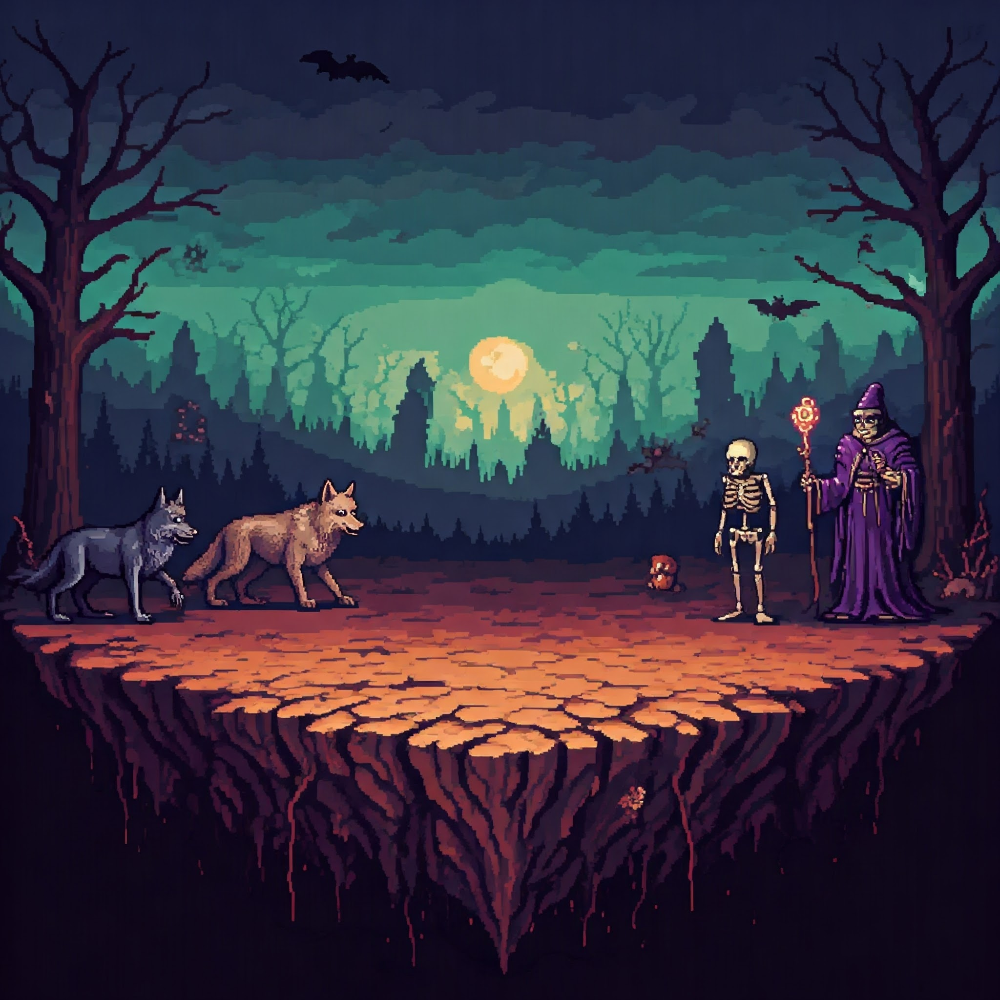

# The Infected Land

A CLI game where you (as the Hero) must defeat the Villain's evil creations to cleanse the infection harming the land
and its residents.

## About The Program

This game uses the Terminal (Linux and macOS) or the Windows Terminal to run the game. It takes in user input via the
keyboard to "Attack" or "Block" the enemy. Both the player's and the enemy's attack are attached to a random number
generator that determines if the action is successful or not.

## Program Dependencies

> I recommend installing these in a Python Virtual Environment (virtualenv).
>
> You can also run my project in a virtualenv.
>
> Learn more about virtualenvs, including how to create one, from
> the [official Python Documentation](https://docs.python.org/3/library/venv.html).

* Python 3
    * Linux OS users: Python is already installed.
    * macOS users and Windows users: Python installation files are available from
      the [official Python website](https://www.python.org/downloads/release/python-3130/).
* Rich Python Package
    * This package can be installed for various operating systems from PyPi [here](https://pypi.org/project/rich/).

## Download Options

* Download the program via one of the two options below:
    * Clone the repo: https://github.com/brittbot-bgates/the_infected_land.git
    * Download the ZIP file from the
      repo: https://github.com/brittbot-bgates/the_infected_land/archive/refs/heads/master.zip

## Running The Program

1. Open the Terminal or Windows Terminal/Command Prompt.
2. Change directory (`cd`) to the `src` directory of the program's directory path. If you downloaded the files into
   your `Downloads` directory then you can use this command:
    - Linux or macOS: `cd /home/$username/Downloads/The-Infected-Land-master/src`
    - Windows: `cd \Users\$username\Downloads\The-Infected-Land-master\src`
3. Type the following command to run the program: `python main.py` or `python3 main.py`.

## Found A Bug? Need Help?

Please file a new issue using the [Issues](https://github.com/BrittanyGates/The-Infected-Land/issues) tab on the repo.

## Version History

* Latest release notes as of November 2025:
    * Refactored the battle logic into its own module (`battles.py`).
    * Resolved circular import issues.
    * Created a helper function to format the storyline on screen, reducing repetitive code.
    * To reduce recursion errors regarding handling user input, replaced recursion function calls with while loops. 
* Latest release notes as of February 2025:
    * Updated the README.
* Latest release notes as of January 2025:
  * Refactored the project to use the Rich package to improve the text displayed on screen.
  * Corrected the logic for all the `try/except` statements.
  * Added and/or fixed docstrings in various modules.
* Latest release notes as of late December 2024:
    * Improved the centering of the displayed text layout.
    * Consolidated multiple related modules into new modules.
    * Fixed typos.
    * Initial release.

## License

This project is licensed under the MIT License. See the LICENSE file for details.

## Acknowledgments

* [Dominique Pizzie](https://gist.github.com/DomPizzie) for the simple README template.